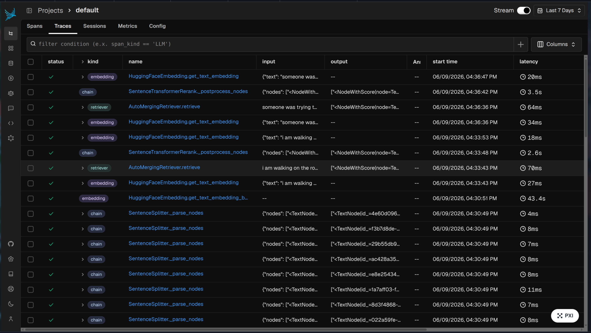
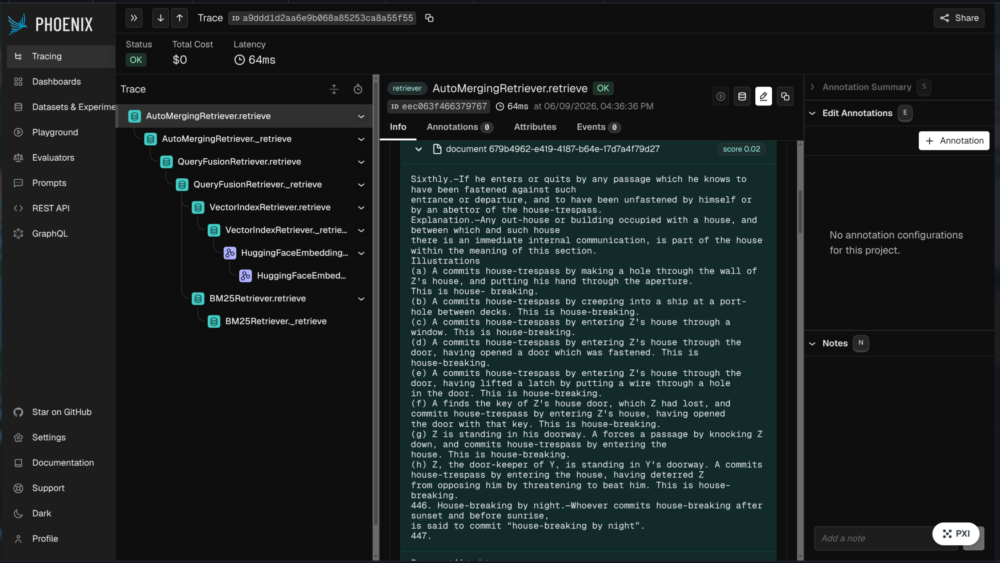

# Legal NLP Chatbot

A Privacy-Preserving Retrieval-Augmented Generation (RAG) Chatbot tailored for answering Indian Legal queries (e.g., questions involving the Indian Penal Code). The system leverages efficient Local Embeddings and a Vector Database for document indexing and retrieval, ensuring your documents remain on your device, merged with high-performance answer generation using the Groq API.


## Features

- **Hierarchical Chunking (Parent-Child)**: Partitions documents using `HierarchicalNodeParser` into 512-token parent nodes and 128-token leaf nodes. This maximizes vector search precision (searching on the smaller leaf nodes) while maintaining broad context for LLM generation (retrieving the larger parent nodes).
- **Auto-Merging Retrieval**: Uses LlamaIndex's `AutoMergingRetriever` to dynamically reconstruct full parent contexts if 50% or more of their child nodes are matched during search.
- **Hybrid Search (Dense + Sparse)**: Combines dense vector search (via ChromaDB) with sparse keyword search (via BM25) using LlamaIndex's `QueryFusionRetriever` with Reciprocal Rank Fusion (RRF) for highly precise search results.
- **Cross-Encoder Re-ranking**: Re-ranks the retrieved context candidates using `BAAI/bge-reranker-base` to surface the top 5 most contextually relevant chunks before passing them to the LLM.
- **Arize Phoenix Observability**: Fully integrated with Arize Phoenix for tracing, monitoring, and debugging LLM execution steps, retrieval scores, and response latencies.
- **Local Document Embeddings**: Uses `BAAI/bge-small-en-v1.5` and persistent `ChromaDB` to index leaf nodes locally without sending sensitive legal data to external servers.
- **Robust PDF Parsing**: Extracts document text smoothly using `PyMuPDF` with an automatic fallback to `pdfplumber`.
- **Dockerized MongoDB Storage**: Stores parent-child node mappings inside a containerized MongoDB database via `MongoDocumentStore`, eliminating heavy memory constraints on startup.
- **Fast Response Generation**: Integrates the Groq API (`llama-3.3-70b-versatile` by default) for lightning-fast and accurate legal advice generation. Includes exponential backoff handling to bypass rate limits smoothly.
- **MongoDB Semantic Cache**: Caches repeat questions and their vector embeddings inside a MongoDB collection (`query_cache`) for BSON storage optimization, loading the cache into an in-memory dictionary on startup for instant cosine-similarity lookups.
- **Aesthetic Interface**: Simple and accessible web interface built with `Gradio`, outfitted with "Google Sans" typography and an intuitive chat view.
- **Automated RAG Evaluation**: Contains an `evaluate.py` script powered by the `ragas` framework and Groq API to assess performance metrics like faithfulness, context recall, and answer relevancy.
- **Modular Directory Structure**: Organized into `src/` (core app logic), `scripts/` (evaluation and helper tools), `tests/` (test scripts), and `data/` (local data inputs and vector databases).

## Technology Stack

- **UI Framework**: Gradio
- **Orchestration**: LlamaIndex, LangChain
- **Embeddings Model**: HuggingFace (`BAAI/bge-small-en-v1.5`)
- **Reranker Model**: HuggingFace (`BAAI/bge-reranker-base`)
- **Vector Database**: ChromaDB (dense retrieval)
- **Document Store & Cache**: MongoDB (running inside a Docker container)
- **Generative AI API**: Groq API
- **Observability**: Arize Phoenix
- **Evaluation Framework**: Ragas

## Project Structure

```
├── data/
│   ├── chroma_db/             # ChromaDB vector store directory
│   └── Legal Document PDFs/   # Directory for source PDF documents
├── scripts/
│   └── evaluate.py            # RAGAS evaluation pipeline
├── src/
│   ├── app.py                 # Gradio App interface and Arize Phoenix setup
│   └── rag_pipeline.py        # Core RAG pipeline logic
├── tests/
│   ├── test_cache.py          # Script to verify semantic caching
│   └── test_hybrid_retrieval.py # Script to test hybrid search + re-ranking
├── Dockerfile                 # Docker build instructions for the python app
├── docker-compose.yml         # Container orchestration configuration
├── requirements.txt           # Python library dependencies
└── README.md
```

## Tracing & Observability (Arize Phoenix)

With Arize Phoenix integrated, you can view execution traces for the RAG pipeline. 

Below is the Phoenix Traces Dashboard displaying overall system latency, active spans, and step-by-step execution times (e.g. embeddings generation, node parsing, and re-ranking):



Below is a detailed trace showing the nested steps of the `AutoMergingRetriever` combining dense vector search (ChromaDB) and sparse keyword search (BM25):



## Prerequisites

- Docker and Docker Compose
- A valid [Groq API Key](https://console.groq.com)

---

## Docker Compose Setup Guide (Recommended)

Running the entire stack with Docker Compose is the easiest way to launch the application, as it handles the database and python application dependency installation, networking, and volumes automatically.

### 1. Configure Environment Variables
Create a `.env` file in the root directory:
```env
GROQ_API_KEY=your_groq_api_key_here
```

### 2. Launch the Stack
Start both the MongoDB database and the RAG application service in detached mode:
```bash
docker compose up -d
```
*Note: The first run will build the application image and download the Hugging Face models (`BAAI/bge-small-en-v1.5` and `BAAI/bge-reranker-base`), which may take a few minutes.*

### 3. Access the Services
* **Gradio Web Interface**: Open [http://localhost:7860](http://localhost:7860) to upload documents and chat.
* **Arize Phoenix Observability**: Open [http://localhost:6006](http://localhost:6006) to view execution traces and debug LLM calls.

### 4. Stopping the services
To stop and clean up the container resources:
```bash
docker compose down
```

---

## Local Setup (Without Docker Compose)

If you prefer to run the application locally on your host machine while running MongoDB in a standalone docker container:

### 1. Start MongoDB Container
```bash
docker run -d \
  --name mongodb_local \
  --restart unless-stopped \
  -p 27017:27017 \
  -v mongodb_data:/data/db \
  mongo:latest
```

### 2. Install Dependencies
```bash
pip install -r requirements.txt
pip install llama-index-storage-docstore-mongodb pymongo
```

### 3. Configure `.env`
Create a `.env` file in the root directory:
```env
GROQ_API_KEY=your_groq_api_key_here
MONGO_URI=mongodb://localhost:27017
```

### 4. Run the Application
```bash
python src/app.py
```
Open [http://localhost:7860](http://localhost:7860) to interact with the application.

---

## Testing & Evaluation

### Run Integration Tests
You can verify the hybrid search and cache performance locally with the scripts in the `tests/` directory:

* **Test Hybrid Retrieval and Re-ranking:**
  ```bash
  python tests/test_hybrid_retrieval.py
  ```

* **Test Semantic Caching:**
  ```bash
  python tests/test_cache.py
  ```

### Run RAGAS Evaluation
To benchmark the faithfulness, recall, and relevancy of the pipeline:
```bash
python scripts/evaluate.py
```
